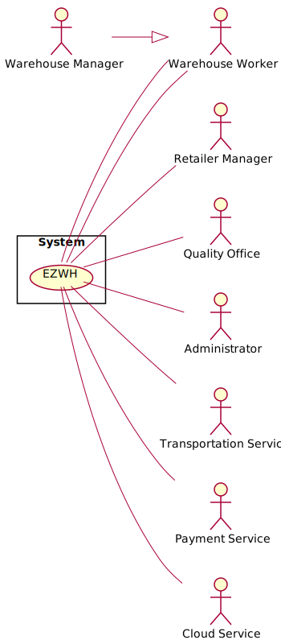

# Requirements Document 

Date: 22 march 2022

Version: 0.0

 
| Version number | Change |
| ----------------- |:-----------|
| | | 

# Contents

- [Informal description](#informal-description)
- [Stakeholders](#stakeholders)
- [Context Diagram and interfaces](#context-diagram-and-interfaces)
	+ [Context Diagram](#context-diagram)
	+ [Interfaces](#interfaces) 
	
- [Stories and personas](#stories-and-personas)
- [Functional and non functional requirements](#functional-and-non-functional-requirements)
	+ [Functional Requirements](#functional-requirements)
	+ [Non functional requirements](#non-functional-requirements)
- [Use case diagram and use cases](#use-case-diagram-and-use-cases)
	+ [Use case diagram](#use-case-diagram)
	+ [Use cases](#use-cases)
    	+ [Relevant scenarios](#relevant-scenarios)
- [Glossary](#glossary)
- [System design](#system-design)
- [Deployment diagram](#deployment-diagram)

# Informal description
Medium companies and retailers need a simple application to manage the relationship with suppliers and the inventory of physical items stocked in a physical warehouse. 
The warehouse is supervised by a manager, who supervises the availability of items. When a certain item is in short supply, the manager issues an order to a supplier. In general the same item can be purchased by many suppliers. The warehouse keeps a list of possible suppliers per item. 

After some time the items ordered to a supplier are received. The items must be quality checked and stored in specific positions in the warehouse. The quality check is performed by specific roles (quality office), who apply specific tests for item (different items are tested differently). Possibly the tests are not made at all, or made randomly on some of the items received. If an item does not pass a quality test it may be rejected and sent back to the supplier. 

Storage of items in the warehouse must take into account the availability of physical space in the warehouse. Further the position of items must be traced to guide later recollection of them.

The warehouse is part of a company. Other organizational units (OU) of the company may ask for items in the warehouse. This is implemented via internal orders, received by the warehouse. Upon reception of an internal order the warehouse must collect the requested item(s), prepare them and deliver them to a pick up area. When the item is collected by the other OU the internal order is completed. 

EZWH (EaSy WareHouse) is a software application to support the management of a warehouse.

# Stakeholders

| Stakeholder Name | Description |
|:-----|:------------|
| Companies | (Retailers is a synonim?) |
| Suppliers |
| Manager | (of Company and of Suppliers) |
| Administrator | |
| Quality Office | |
| Physical WareHouse | (maybe Renting Company?) |
| Organizational unit | |
| Competitors | |
| StartUp Owner | |
| Startup Financer | |
| Cloud Service (Database) | |
| Payment service | |
| Transportation Company | |

# Context Diagram and interfaces

## Context Diagram

## Interfaces

| Actor | Logical Interface | Physical Interface |
|:------|:------------------|:-------------------|
| Manager | GUI | M&K | Ambiguo: da dividere tra Company Manager e Supplier Manager
| Administrator | GUI | M&K |
| Payment Service | Internet Connection | API |
| Cloud Service | Internet Connection | API |
| Transportation Company | Phone Calls or Internet Connection | Phone or M&K |

# Stories and personas
Mario, 30, is the manager of a big company's warehouse, handling hundresds of items per day. He has always managed the position of the goods by himself, leading to some management problems during the years. Also the re-fill process is handled by him, directly calling to different suppliers asking for availabilities of items. He would really like to use an application which can automatize this entire handling process. 

Ercole, 45, has been recently hired as manager in a company that acts as a supplier for other companies or retailers, by selling mechanical components to them. In his previous job, he was used to a software which automatically checks if an order is satisfiable or not and contacts the transportation company. Now he has to manually check the availabilities for every item, and directly phone the transaportation company. He would like to emulate the same experience got in his previous mansion.

Ezio, 35, is the chief of one of the Organizational Unit that composes a worldwide company. Anytime he needs an item from the central warehouse, he send an internal order request to the headquarter offices, which will be only later sent to the warehouse, resulting in a huge delay of time due to burocracy. He would really appreciate a software that manages a direct communication with the warehouse manager. 

# Functional and non functional requirements

## Functional Requirements

| ID | Description |
|:---|:------------|
| F1 | Create user (username, pwd) |
| F2 | Set-Up account |
| F2.1 | Setup account of manager of company |
| F2.2 | Setup account of manager of suppliers |
| F3| Manage items |
| F3.1 | Keep track of position of the items |
| F3.2 | Handle internal orders |
| F4 | Quality check |
| F4.1 | Test items with different criteria |
| F4.2 | Reject defected items |
| F5 | Manage request (orders?) (Create, Update and Delete) |
| F5.1 | Reorder short supply items |

## Non Functional Requirements

\<Describe constraints on functional requirements>

| ID        | Type (efficiency, reliability, ..)           | Description  | Refers to |
| ------------- |:-------------:| :-----:| -----:|
|  NFR1     |   |  | |
|  NFR2     | |  | |
|  NFR3     | | | |
| NFRx .. | | | | 

# Use case diagram and use cases

## Use case diagram
\<define here UML Use case diagram UCD summarizing all use cases, and their relationships>

\<next describe here each use case in the UCD>
### Use case 1, UC1
| Actors Involved        |  |
| ------------- |:-------------:| 
|  Precondition     | \<Boolean expression, must evaluate to true before the UC can start> |
|  Post condition     | \<Boolean expression, must evaluate to true after UC is finished> |
|  Nominal Scenario     | \<Textual description of actions executed by the UC> |
|  Variants     | \<other normal executions> |
|  Exceptions     | \<exceptions, errors > |

##### Scenario 1.1 

\<describe here scenarios instances of UC1>

\<a scenario is a sequence of steps that corresponds to a particular execution of one use case>

\<a scenario is a more formal description of a story>

\<only relevant scenarios should be described>

| Scenario 1.1 | |
| ------------- |:-------------:| 
|  Precondition     | \<Boolean expression, must evaluate to true before the scenario can start> |
|  Post condition     | \<Boolean expression, must evaluate to true after scenario is finished> |
| Step#        | Description  |
|  1     |  |  
|  2     |  |
|  ...     |  |

##### Scenario 1.2

##### Scenario 1.x

### Use case 2, UC2
..

### Use case x, UCx
..

# Glossary

# System Design
\<describe here system design>

\<must be consistent with Context diagram>

# Deployment Diagram 

\<describe here deployment diagram >

